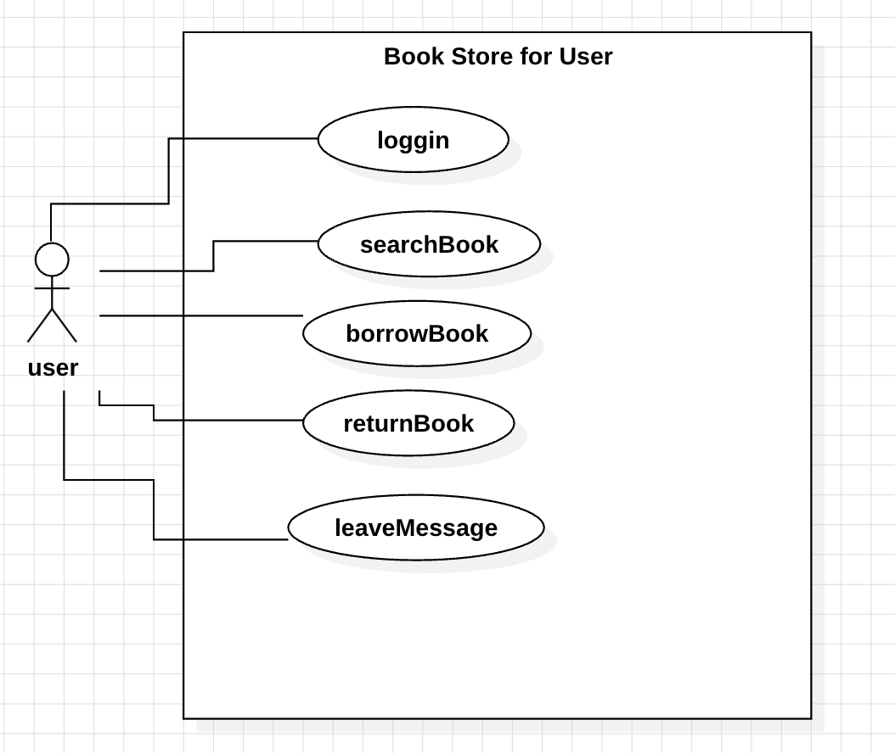
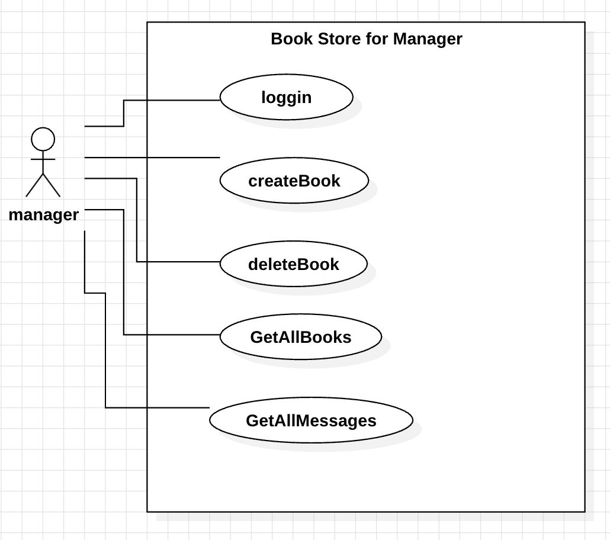
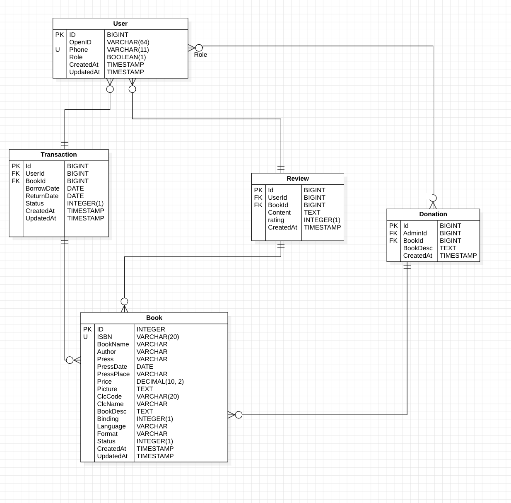

# 项目设计

## 需求分析
- 用户功能：
    - 借书：按ISBN搜索并借书
    - 还书：查看当前借阅记录并归还书籍
- 管理员功能：
    - 捐书：通过ISBN录入图书信息
    - 删除书籍：删除不再需要的书籍
- 书籍信息展示：
    - 书名、作者、出版社等完整信息
    - 展示捐赠者的书籍介绍和借阅者的评价
- 登录注册：
    - 用户通过微信登陆并绑定手机账号

附加需求：
- 数据分析：书籍的借阅次数统计
- 分类管理：通过图书类别进行书籍分类
- 图片上传：用户可以上传书籍信息图片

## 设计阶段
### 1. 用例图



### 2. 数据库设计
- User: ID, OpenID, Phone, Role (用户/管理员), CreatedAt
- Book: ID, ISBN, BookName, Author, Press, Price, Pictures, ClcCode, BookDesc, Language, Status (可借/借出), CreatedAt
- Transaction: ID, UserID, BookID, BorrowDate, ReturnDate, Status (借阅中/已归还), CreatedAt
- Review: ID, UserID, BookID, Content, Rating, CreatedAt
- Donation: ID, AdminID, BookID, BookDesc, CreatedAt



### 3. 功能表

| 模块	   | 功能	      | 描述                 |
|-------|----------|--------------------|
| 用户管理  | 登录注册     | 微信OAuth登录,绑定手机号    |
| 图书管理  | 借书/还书    | 用户按ISBN借书，还书时更新状态  |
| 图书展示  | 	查看书籍详情  | 	展示书籍信息、捐赠者介绍、用户评价 |
| 借阅管理	 | 借阅记录     | 	记录每本书的借阅历史及当前状态   |
| 管理员功能 | 	添加/删除书籍 | 	管理员通过ISBN管理书籍     |
| 数据分析	 | 借阅统计     | 	每本书的借阅次数与用户活跃度统计  |

### 4 API设计
- 书籍模块：
    - GET /books: 获取书籍列表
    - GET /books/{isbn}: 按ISBN查询书籍详情
    - POST /books: 管理员添加书籍
    - DELETE /books/{isbn}: 管理员删除书籍
- 借阅模块：
    - POST /borrow: 用户借阅书籍
    - POST /return: 用户归还书籍
- 评价模块：
    - GET /reviews/{isbn}: 获取书籍评价
    - POST /reviews: 用户评价书籍
- 用户模块：
    - POST /login: 用户登录
    - POST /bind-phone: 绑定手机号

## 项目结构
采用最经典的MVC架构，常见的软件层次结构
- 表示层 (Presentation Layer)：接收用户请求和返回响应，通常对应于控制器（Controller）部分。 
- 业务逻辑层 (Business Logic Layer) / 服务层 (Service Layer)：处理具体的业务规则，通常由 Service 组成。 
- 数据访问层 (Data Access Layer)：与数据库交互，负责持久化存储，通常由模型和DAO组成。 
- 集成层(Integration Layer)：与外部服务进行交互，如调用第三方API。 
- 辅助层(Utility Layer)：包含辅助工具和通用功能。

```
project/
├── cmd/                     # 主程序入口
│   ├── main.go              # 主程序启动文件
│   └── admin/               # 管理端入口
│       └── main.go          # 管理员端入口文件
├── pkg/                     # 业务逻辑代码
│   ├── config/              # 配置文件
│   │   └── config.go        # 配置管理
│   ├── controllers/         # 控制器层
│   │   ├── book_controller.go # 处理图书相关请求
│   │   ├── user_controller.go # 处理用户相关请求
│   │   └── auth_controller.go # 登录注册相关逻辑
│   ├── models/              # 数据模型层
│   │   ├── book.go          # 图书数据模型
│   │   ├── user.go          # 用户数据模型
│   │   ├── transaction.go   # 借阅数据模型
│   │   └── review.go        # 评价数据模型
│   ├── routes/              # 路由层
│   │   ├── router.go        # 路由注册
│   │   └── middleware.go    # 中间件配置（如认证、跨域）
│   ├── utils/               # 工具函数
│   │   ├── jwt.go           # JWT生成与解析
│   │   ├── validator.go     # 数据验证工具
│   │   ├── logger.go        # 日志工具
│   │   └── http.go          # HTTP响应工具
├── docs/                    # 文档目录
│   └── api.md               # API设计文档
├── migrations/              # 数据库迁移
│   └── 001_init.sql         # 初始数据库脚本
├── test/                    # 测试代码
│   ├── book_test.go         # 图书相关单元测试
│   └── user_test.go         # 用户相关单元测试
├── .env                     # 环境变量
├── go.mod                   # Go依赖管理
├── go.sum                   # Go依赖版本锁定
└── README.md                # 项目说明
```

### 界面设计